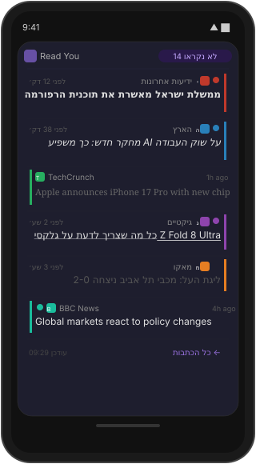
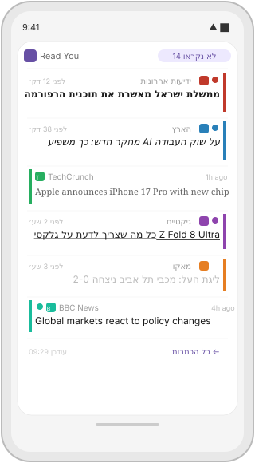
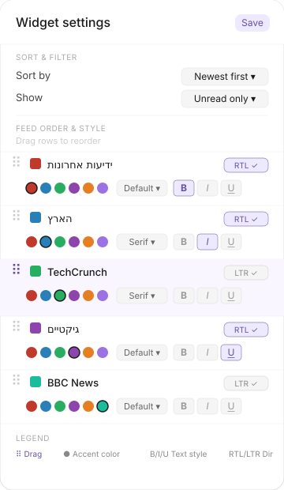

# NewsFeed Widget

A standalone Android home screen widget that fetches and displays RSS/Atom feeds directly on your home screen — no companion app required. Built for full **RTL Hebrew support** and designed for the **Galaxy Z Fold** inner display.

---

## Screenshots

<table>
  <tr>
    <td align="center"><b>Amethyst theme</b></td>
    <td align="center"><b>Lavender theme</b></td>
    <td align="center"><b>Config panel</b></td>
  </tr>
  <tr>
    <td></td>
    <td></td>
    <td></td>
  </tr>
  <tr>
    <td align="center"><sub>Mixed Hebrew RTL + English LTR<br>feeds with per-feed accent colors</sub></td>
    <td align="center"><sub>Same layout in Lavender theme</sub></td>
    <td align="center"><sub>Long-press widget → Edit widget<br>Drag ⠿ to reorder · × to remove</sub></td>
  </tr>
</table>

---

## How it works

The widget is **fully standalone** — it fetches RSS/Atom feeds directly over the network using OkHttp. You add feed URLs yourself, or import them from an OPML file exported by Feedly, Reeder, or any other RSS reader.

---

## Features

### Feed display
- Shows latest RSS/Atom articles directly on the home screen
- **Colored circle icon** with the feed's initial letter at the start of each article row
- Unread count badge in the widget header
- Unread dot indicator per article
- Per-feed colored left/right accent stripe matching the circle icon
- Article **date and time** — shows `HH:mm` for today's articles, `dd/MM HH:mm` for older ones
- Refresh countdown in the footer (`↻ in Xmin` / `↻ <1min`) — auto-updates every 60 seconds without any interaction; tap to refresh immediately
- **Settings button** (⚙) in the footer row opens the widget config screen directly from the widget

### Scrollable article list
The widget uses a scrollable list — swipe up and down within the widget to browse all articles without leaving the home screen.

### Tap to read inline
Tapping an article title expands it inside the widget:
- Article description or full page content appears below the title
- **Open article →** button appears to open the full article externally
- Tap the expanded article again to collapse it

### Article length modes
| Mode | Description |
|---|---|
| Short | Up to 100 characters of the RSS excerpt |
| Medium | Up to 400 characters of the RSS excerpt (default) |
| Full | Fetches the full web page content on demand — tap **Load full article ↓** to fetch |

In **Full** mode, the widget fetches the article's web page, extracts the main `<article>` / `<main>` content, strips navigation and scripts, and displays the plain-text result inline. The fetched content is cached for the current widget session.

### Open article externally
The "Open article in" setting controls where the Open button sends you:
- **Browser** — opens in your default web browser (default)
- **Share sheet** — share the article URL to any app

Tapping Open also **marks the article as read** and triggers a widget refresh.

### Sort options
| Option | Description |
|---|---|
| Newest first | Latest articles at the top (default) |
| Oldest first | Oldest articles at the top |
| By feed | Round-robin interleave — one article per feed per round, equal representation |
| Unread first | Unread articles always shown above read ones |

### Filter options
| Option | Description |
|---|---|
| All | Show every article |
| Unread only | Show only articles you haven't read yet |
| Read only | Show only articles you've already read |

### Per-feed customization
Every feed can be configured independently:

#### Accent color
Each feed is automatically assigned a distinct color from a palette of 10 when first imported. You can change it manually in Settings. The color is used for the circle icon, article stripe, source label, and unread dot.

#### Font
| Option | Best for |
|---|---|
| Default | General news, system sans-serif |
| Serif | Editorial / newspaper-style feeds |
| Mono | Tech, code, or developer feeds |

#### Text style
Apply any combination of **Bold**, *Italic*, and <u>Underline</u>.

#### Text direction (RTL / LTR)
Each feed has its own direction toggle. RTL flips the entire card: stripe moves to the right, source name aligns right, timestamp moves left. Mix RTL and LTR feeds in the same widget simultaneously.

#### Display mode (TXT / IMG)
In image mode, a thumbnail is pre-fetched from the RSS feed's image tags (`<media:thumbnail>`, `<media:content>`, `<enclosure>`, or the first `` in the article description) and cached locally for 24 hours. The thumbnail scales with your font size setting.

### Global font size
A slider in Settings scales all article text from 75% to 150%.

### Widget themes
Seven built-in themes, each with a distinct light and dark variant selectable independently of the system theme:

| Theme | Character |
|---|---|
| Auto | Follows the system light/dark setting (Material You) |
| Lavender | Soft lavender editorial — light purple palette |
| Amethyst | Rich amethyst — deep purple dark palette |
| Glassy | Frosted glass with 3D depth, semi-transparent surface |
| Simple | Pure black and white, no color |
| Aerospace | Amber on near-black charcoal — mission-control feel |
| Data Science | Teal-mint on deep navy — silicon-lab precision |
| Glamour | Beige / warm cream with handwriting-style headlines |

### Feed management
- **Add by URL** — paste any RSS or Atom feed URL; the widget fetches and validates the feed title automatically
- **Import OPML** — import feeds from any OPML file (grouped and flat OPML supported)
- **Export OPML** — share your current feed list as a standard OPML 2.0 file
- **Drag to reorder** — drag feeds in the config screen to control their display order
- **Remove** — tap × on any feed row to delete it

### Article accumulation
The widget merges freshly fetched articles with previously stored ones (up to 300 total, deduplicated by ID, sorted by date). Articles stay available even between refreshes.

### Hebrew / RTL news site compatibility
Feeds are fetched with browser-like HTTP headers so Israeli news sites (ynet, rotter.net, N12, כאן, וואלה, גלובס) do not block the request. Charset encoding is auto-detected (Windows-1255 Hebrew feeds are handled correctly).

---

## Widget sizes

| Size | Cells | Best for |
|---|---|---|
| Compact | 2×4 | Cover display / sidebar |
| Standard | 4×4 | Inner display (recommended) |
| Large | 5×4 | Maximum article count |

The widget is fully resizable — drag its edges on the home screen to adjust.

---

## Configuration

Long-press the widget on your home screen → tap **Edit widget** to open the settings screen.  
You can also tap the **⚙** button in the widget footer.

### Settings screen layout
1. **Sort & Filter** — global sort order, read/unread filter, refresh interval, "Open article in" dropdown, article length, font size slider, theme picker
2. **Add Feed** — enter a feed URL and tap **Add**, or use **Import OPML** / **Export OPML**
3. **Feed order & style** — one draggable row per feed with:
   - Grip handle (drag ⠿ to reorder)
   - × button to remove
   - Color swatch (tap to open color picker)
   - Display name (tap to edit name or URL)
   - Font dropdown
   - **B** / *I* / <u>U</u> style toggles
   - RTL / LTR direction toggle
   - TXT / IMG display mode toggle

Changes take effect immediately after tapping **Save**.

---

## Background refresh

The widget polls feeds automatically using WorkManager. Configure the interval in Settings:

| Interval | Notes |
|---|---|
| 15 minutes | Minimum (Android WorkManager floor) — default |
| 30 minutes | |
| 1 hour | |
| 2 hours | |
| 4 hours | |
| 6 hours | |
| 12 hours | Maximum battery-friendly |

The countdown to the next refresh is shown in the widget footer and updates every minute automatically.

---

## Installation

### Step 1 — Download the APK

1. Go to the [Actions tab](https://github.com/Had-com/NewsFeed-widget/actions) of this repo
2. Click the latest **Build APK** run
3. Download the **ReadYouWidget-debug** artifact (a `.zip` file)
4. Unzip it — inside you will find `app-debug.apk`
5. Transfer the `.apk` to your Android phone (via USB, Google Drive, WhatsApp to yourself, etc.)

### Step 2 — Allow installation from unknown sources

Android blocks apps not downloaded from the Play Store by default. You need to allow your file manager (or browser) to install APKs:

**On Samsung Galaxy (One UI):**
1. Open **Settings → Apps**
2. Tap the **⋮ menu** (top right) → **Special access**
3. Tap **Install unknown apps**
4. Find the app you will use to open the APK (e.g. **My Files** or **Chrome**) and toggle **Allow from this source** ON

**On stock Android:**
1. Open **Settings → Apps & notifications → Special app access → Install unknown apps**
2. Select the app you will use to open the APK and enable it

> **Samsung Auto Blocker:** On newer Samsung devices, a feature called **Auto Blocker** may prevent installation even after allowing unknown sources. To disable it:
> **Settings → Security and privacy → Auto Blocker** → toggle it **OFF**

### Step 3 — Install the APK

1. Open the `.apk` file using your file manager (e.g. **My Files** on Samsung)
2. A warning screen will appear:

   > *"This type of file can harm your device. Do you want to keep [filename]?"*  
   > or  
   > *"Install blocked — Google Play Protect doesn't recognize this app"*

3. **Look for a small, often grey or understated "Install anyway" or "More details" link** near the bottom of the warning screen — it is intentionally de-emphasized. Tap it.
4. On the next screen tap **Install**
5. Wait for the installation to complete, then tap **Done**

> ⚠️ The widget is open-source and safe. The warning appears because it is not distributed through the Play Store. You can review all source code in this repository.

### Step 4 — Add the widget

1. Long-press an empty area of your home screen
2. Tap **Widgets**
3. Search for or scroll to find **NewsFeed**
4. Drag the widget to your home screen
5. The settings screen opens automatically — add your first feed URL or import an OPML file

---

## RTL Hebrew support

- System locale `iw` (Hebrew) automatically loads Hebrew UI strings
- Each feed's layout direction is controlled independently
- No custom fonts required — Hebrew glyphs use Android system fonts
- The config screen itself also supports RTL when the device locale is Hebrew
- Hebrew news sites (ynet, rotter.net, N12, כאן, וואלה, גלובס) are fetched with browser-like headers to bypass bot detection

---

## Project structure

```
app/src/main/
├── assets/
│   └── default_feeds.opml            # Default Hebrew news feeds loaded on first launch
├── java/com/readyou/widget/
│   ├── glance/
│   │   ├── ReadYouWidget.kt          # Glance widget + receiver + AlarmManager clock tick
│   │   ├── FeedItemRow.kt            # Per-article row (circle icon, expand/collapse, thumbnail, date)
│   │   ├── WidgetWorker.kt           # WorkManager refresh job + article merge + thumbnail download
│   │   ├── WidgetThemes.kt           # 7 colour schemes (Lavender, Amethyst, Glassy, Simple, Aerospace, Data Science, Glamour)
│   │   ├── BootReceiver.kt           # Reschedules WorkManager and clock tick after device reboot
│   │   ├── RefreshNowCallback.kt     # ActionCallback — immediate refresh on footer tap
│   │   ├── ToggleExpandCallback.kt   # ActionCallback — expand/collapse article in widget
│   │   ├── FetchFullArticleCallback.kt # ActionCallback — fetches full web page content for "Full" mode
│   │   └── OpenExternalCallback.kt   # ActionCallback — open article URL, mark read
│   ├── config/
│   │   ├── WidgetConfigActivity.kt   # Settings screen (sort, filter, feeds, font size, theme, OPML)
│   │   ├── FeedConfigRow.kt          # Per-feed controls row (color, font, B/I/U, RTL/LTR, IMG/TXT)
│   │   └── ColorPickerGrid.kt        # 12-color preset picker
│   ├── data/
│   │   ├── FeedConfig.kt             # Data models (FeedConfig, WidgetConfig, ArticleItem, enums)
│   │   ├── WidgetConfigStore.kt      # DataStore — widget config persistence
│   │   ├── WidgetStateKey.kt         # Glance DataStore preference keys
│   │   ├── ReadStatusStore.kt        # DataStore — read article ID persistence
│   │   ├── ReadYouRepository.kt      # RSS/Atom fetching, charset fix, image extraction, thumbnails
│   │   ├── ThumbnailHelper.kt        # Shared cache file path helper for thumbnails
│   │   ├── FaviconHelper.kt          # Shared cache file path helper for feed favicons
│   │   └── OpmlManager.kt            # OPML 2.0 import/export
└── res/
    ├── drawable/
    │   ├── ic_launcher_foreground.xml   # RSS + N vector icon foreground
    │   └── ic_launcher_background.xml  # Purple icon background
    ├── mipmap-anydpi-v26/
    │   ├── ic_launcher.xml             # Adaptive icon (Android 8+)
    │   └── ic_launcher_round.xml       # Round adaptive icon
    ├── values/strings.xml              # English strings
    ├── values-iw/strings.xml           # Hebrew strings (עברית)
    ├── xml/appwidget_info.xml          # Widget metadata
    └── xml/file_paths.xml             # FileProvider paths (OPML export)
```

---

## Dependencies

| Library | Version | Purpose |
|---|---|---|
| `androidx.glance:glance-appwidget` | 1.1.0 | Widget framework (Compose-based) |
| `androidx.work:work-runtime-ktx` | 2.9.0 | Background refresh via WorkManager |
| `androidx.datastore:datastore-preferences` | 1.1.1 | Config + read-status persistence |
| `kotlinx-serialization-json` | 1.6.3 | Config and articles JSON serialization |
| `com.squareup.okhttp3:okhttp` | 4.12.0 | RSS/Atom feed HTTP fetching |
| `sh.calvin.reorderable` | 2.3.0 | Drag-to-reorder in config screen |

---

## Requirements

- Android 8.0 (API 26) or higher
- Internet permission (for RSS fetching)

---

## License

MIT — see [LICENSE](LICENSE)
